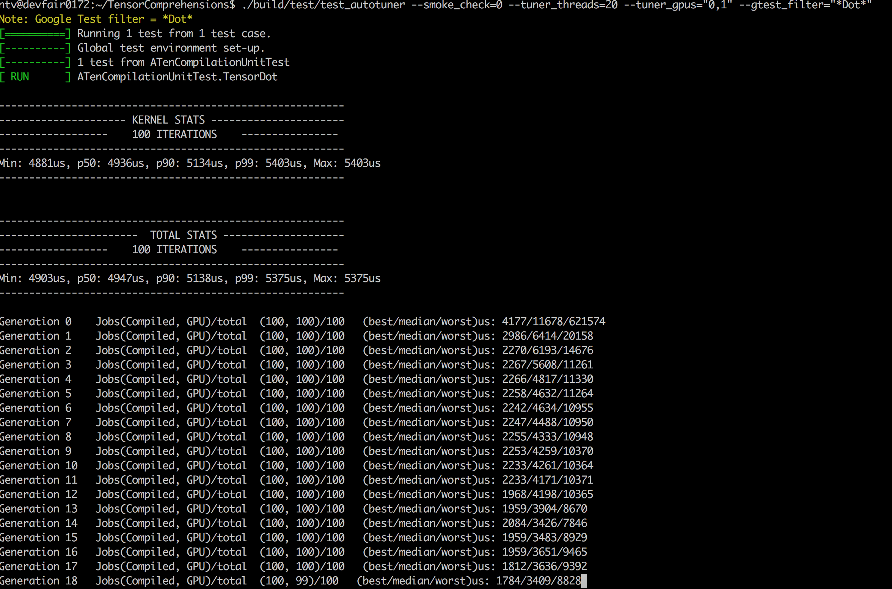

# 

Tensor Comprehensions (TC) is a fully-functional C++ library to *automatically* synthesize high-performance machine learning kernels using [Halide](https://github.com/halide/Halide), [ISL](http://isl.gforge.inria.fr/) and NVRTC or LLVM. TC additionally provides basic integration with Caffe2 and PyTorch. We provide more details in our paper on [arXiv](https://arxiv.org/abs/1802.04730).

This library is designed to be highly portable, machine-learning-framework agnostic and only requires a simple tensor library with memory allocation, offloading and synchronization capabilities.

For now, we have integrated TC with the [Caffe2](https://github.com/caffe2/caffe2) and [PyTorch](https://github.com/pytorch/pytorch/).

# A simple example

The following illustrates a short but powerful feature of the library: the capacity to JIT-compile high-performance machine learning kernels on demand, for specific sizes.

```python
import tensor_comprehensions as tc
import torch
lang = """
def tensordot(float(N, C1, C2, H, W) I0, float(N, C2, C3, H, W) I1) -> (O) {
    O(n, c1, c3, h, w) +=! I0(n, c1, c2, h, w) * I1(n, c2, c3, h, w)
}
"""
N, C1, C2, C3, H, W = 32, 512, 8, 2, 28, 28
tensordot = tc.define(lang, name="tensordot")
I0, I1 = torch.randn(N, C1, C2, H, W).cuda(), torch.randn(N, C2, C3, H, W).cuda()
best_options = tensordot.autotune(I0, I1, cache=True)
out = tensordot(I0, I1, options=best_options)
```

After a few generations of `autotuning` on a 2-GPU P100 system, we see results resembling:



In C++ a minimal autotuning example resembles the [following](example/example_tensordot.cc):
```cpp
TEST(TensorDot, SimpleAutotune) {
  // 1. Define and setup the TC compilation unit with CUDA memory
  // management backed by ATen tensors.
  std::string tc = R"TC(
def tensordot(float(N, C1, C2, H, W) I0,
              float(N, C2, C3, H, W) I1)  -> (O)
{
    O(n, c1, c3, h, w) +=! I0(n, c1, r_c2, h, w) * I1(n, r_c2, c3, h, w)
}
  )TC";
  tc::ATenCompilationUnit<tc::CudaTcExecutor> atCompl;
  atCompl.define(tc);

  // 2. Allocate tensors with random data.
  at::Tensor I0 = at::CUDA(at::kFloat).rand({32,  8, 16, 17, 25});
  at::Tensor I1 = at::CUDA(at::kFloat).rand({32, 16, 2, 17, 25});

  // 3. Run autotuning with evolutionary search starting from a naive option.
  auto options = tc::CudaMappingOptions::makeNaiveMappingOptions();
  tc::autotune::GeneticAutotunerATen geneticAutotuneATen(tc);
  auto bestOption = geneticAutotuneATen.tune(
    "/tmp/save_results", "tensordot", {I0, I1}, options);

  // 4. Compile and run the TC with the best option.
  // Outputs get allocated; could also be pre-allocated and passed.
  auto handle = atCompl.compile("tensordot", {I0, I1}, bestOption.getValue());
  std::vector<at::Tensor> outputs;
  auto duration = atCompl.run("tensordot", {I0, I1}, outputs, handle, true);
  std::cout
       << "tensordot size I0: " << I0.sizes() << ", "
       << "size I1: " << I1.sizes() << " ran in: "
       << std::chrono::duration_cast<std::chrono::microseconds>(duration).count()
       << "us\n";
}
```

Note that we only need to **autotune a TC once** to obtain reasonable mapping options
that can translate to other problem sizes for a given TC as the following snippet
illustrates:
```cpp
// 5. Reuse bestOptions from autotuning on another kernel
for (auto sizes : std::vector<std::pair<at::IntList, at::IntList>>{
         {{4, 9, 7, 16, 14}, {4, 7, 3, 16, 14}},
         {{8, 5, 11, 10, 10}, {8, 11, 16, 10, 10}},
     }) {
  at::Tensor I0 = at::CUDA(at::kFloat).rand(sizes.first);
  at::Tensor I1 = at::CUDA(at::kFloat).rand(sizes.second);
  auto handle = atCompl.compile("tensordot", {I0, I1}, bestOption.getValue());
  std::vector<at::Tensor> outputs;
  auto duration = atCompl.run("tensordot", {I0, I1}, outputs, handle, true);
  std::cout << "tensordot size I0: " << I0.sizes() << ", "
            << "size I1: " << I1.sizes() << " ran in: "
            << std::chrono::duration_cast<std::chrono::microseconds>(duration)
                   .count()
            << "us\n";
}
```

Putting it all together, one may see:
```shell
> build$ ./examples/example_simple
[==========] Running 1 test from 1 test case.
[----------] Global test environment set-up.
[----------] 1 test from TensorDot
[ RUN      ] TensorDot.SimpleAutotune
Loading proto from: /tmp/save_results.options and /tmp/save_results.cuda
Generation 0    Jobs(Compiled, GPU)/total  (10, 10)/10   (best/median/worst)us: 226/4238/7345
Generation 1    Jobs(Compiled, GPU)/total  (10, 10)/10   (best/median/worst)us: 220/221/233
Generation 2    Jobs(Compiled, GPU)/total  (10, 10)/10   (best/median/worst)us: 220/221/234
Dumping cache to /tmp/save_results.cuda/options
tensordot size I0: [16, 8, 16, 17, 25], size I1: [16, 16, 2, 17, 25] ran in: 239us
tensordot size I0: [4, 9, 7, 16, 14], size I1: [4, 7, 3, 16, 14] ran in: 56us
tensordot size I0: [8, 5, 11, 10, 10], size I1: [8, 11, 16, 10, 10] ran in: 210us
[       OK ] TensorDot.SimpleAutotune (27812 ms)
[----------] 1 test from TensorDot (27812 ms total)

[----------] Global test environment tear-down
[==========] 1 test from 1 test case ran. (27812 ms total)
[  PASSED  ] 1 test.
```

Tuning results are then available and reusable in ```/tmp/save_results.cuda``` and ```/tmp/save_results.proto```.

Interestingly, note that running the same example again will start form the best saved results and improve upon them.
Of course this has diminishing returns:
```shell
> build$ ./examples/example_simple
[==========] Running 1 test from 1 test case.
[----------] Global test environment set-up.
[----------] 1 test from TensorDot
[ RUN      ] TensorDot.SimpleAutotune
Loading proto from: /tmp/save_results.options and /tmp/save_results.cuda
Generation 0    Jobs(Compiled, GPU)/total  (10, 10)/10   (best/median/worst)us: 256/258/270
Generation 1    Jobs(Compiled, GPU)/total  (10, 10)/10   (best/median/worst)us: 158/255/616
Generation 2    Jobs(Compiled, GPU)/total  (10, 10)/10   (best/median/worst)us: 157/252/720
Dumping cache to /tmp/save_results.cuda/options
tensordot size I0: [16, 8, 16, 17, 25], size I1: [16, 16, 2, 17, 25] ran in: 172us
tensordot size I0: [4, 9, 7, 16, 14], size I1: [4, 7, 3, 16, 14] ran in: 44us
tensordot size I0: [8, 5, 11, 10, 10], size I1: [8, 11, 16, 10, 10] ran in: 88us
[       OK ] TensorDot.SimpleAutotune (28232 ms)
[----------] 1 test from TensorDot (28232 ms total)

[----------] Global test environment tear-down
[==========] 1 test from 1 test case ran. (28232 ms total)
[  PASSED  ] 1 test.
```

We have not yet characterized the precise fraction of peak performance we obtain but it is not uncommon to obtain 80%+ of peak shared memory bandwidth after autotuning. Solid register-level optimizations are still in the work but TC in its current form already addresses the productivity gap between the needs of research and the needs of production. Which is why we are excited to share it with the entire community and bring this collaborative effort in the open.

# Documentation

**General**: You can find detailed information about Tensor Comprehensions [here](https://facebookresearch.github.io/TensorComprehensions/).

**C++ API**: We also provide documentation for our C++ API which can can be found [here](https://facebookresearch.github.io/TensorComprehensions/api/)

# Installation

## Binaries

We provide conda package for making it easy to install and use TC binary. Please refer to our documentation
[here](https://facebookresearch.github.io/TensorComprehensions/framework/pytorch_integration/getting_started.html) for instructions.

## From Source

You can find documentation [here](https://facebookresearch.github.io/TensorComprehensions/) which contains instructions for building TC via docker, conda packages or in non-conda environment.

# Communication

* **Email**: tensorcomp@fb.com
* **GitHub issues**: bug reports, feature requests, install issues, RFCs, thoughts, etc.
* **Slack**: For discussion around framework integration, build support, collaboration, etc. join our slack channel https://tensorcomprehensions.herokuapp.com/.

# Code of Conduct
See the [CODE_OF_CONDUCT.md](CODE_OF_CONDUCT.md) file for more details.

# License
Tensor Comprehensions is distributed under a permissive Apache v2.0 license, see the [LICENSE](LICENSE) file for more details.

# Contributing
See the [CONTRIBUTING.md](CONTRIBUTING.md) file for more details.
