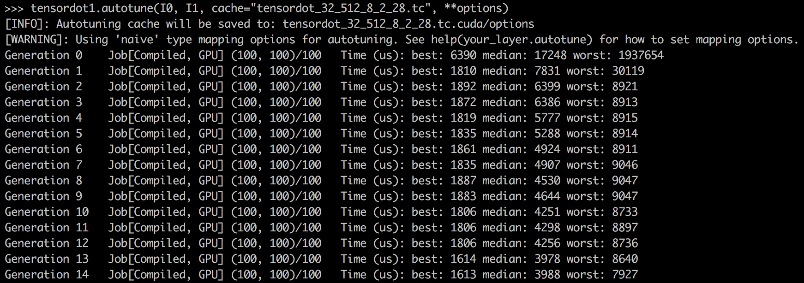

Using TC to get fast CUDA code for TensorDot
============================================

In this tutorial, we will do a case study of implementing TensorDot with TC. This
is a good example of taking a NumPy operation and using TC to get fast CUDA code
for it. We will also see how to tune the CUDA code to a better performance.
All of this is possible with only 3-4 lines of code.

For this tutorial, you will need to install Tensor Comprehensions binary. You can
get binary builds of Tensor Comprehensions with: ``conda install -y -c pytorch -c tensorcomp tensor_comprehensions``

About TensorDot
---------------

Assume that we have two tensors, one with dimension :code:`(N, C1, C2, H, W)` and
one with dimension :code:`(N, C2, C3, H, W)`, and we want to do a gemm-type
computation on the :code:`C` dimensions to get an output of shape :code:`(N, C1, C3, H, W)`.
Basically, for each :code:`(N, H, W)` combination, we want to do a reduction from
:code:`(C1, C2) * (C2, C3) = (C1, C3)`.

So this operation can be represented as :code:`N x H x W` independent gemms and
one could transpose :code:`H` and :code:`W` to the beginning of the matrix and then
use a stock batched matrix multiply operation. This seems like an easy way to implement
:code:`TensorDot` operation but that requires changes in data layout which could
lead to bad kernel performance for memory bound operations. It would be better
if we could generate a CUDA kernel which operated on the original data layout.

So let's walk through the steps needed to implement TensorDot with TC.

Step 1: Write TC for TensorDot
------------------------------

First, we express the TensorDot operation in TC language using Einstein notation.
For that, we will start from a simple matrix multiply operation and evolve that
to TensorDot operation.

A simple 2D matrix multiply operation in TC is expressed as:

.. code::

     def matmul(float(M, N) X, float(N, K) W) -> (output) {
         output(m, k) +=! X(m, r_n) * W(r_n, k)
     }

The variable :code:`r_n` is being reduced in above expression. Now, let's write a
**batched matrix-multiply** operation using above expression. For that, we need to
add a batch dimension to it and the expression becomes:

.. code::

     def batch_matmul(float(B, M, N) X, float(B, N, K) W) -> (output) {
         output(b, m, k) +=! X(b, m, r_n) * W(b, r_n, k)
     }

Now, for the tensordot operation, we need to add spatial dimensions :code:`H` and :code:`W`
to the batched matrix multiply, and the expression for TensorDot becomes:

.. code::

     def tensordot(float(B, C1, C2, H, W) I0, float(B, C2, C3, H, W) I1) -> (O) {
         O(b, c1, c3, h, w) +=! I0(b, c1, r_c2, h, w) * I1(b, r_c2, c3, h, w)
     }

Now, we have our :code:`TensorDot` expression, we are ready to use this and write
3-4 lines of code to get our CUDA kernel.

.. code-block:: python

    # import tc and torch both
    import tensor_comprehensions as tc
    import torch
    # define the operation as TC language
    lang = """
    def tensordot(float(N, C1, C2, H, W) I0, float(N, C2, C3, H, W) I1) -> (O) {
        O(n, c1, c3, h, w) +=! I0(n, c1, r_c2, h, w) * I1(n, r_c2, c3, h, w)
    }
    """

Step 2: Register operation with TC
----------------------------------

Now, we will use the TC :code:`lang` and register it with the TC backend by calling
:code:`tc.define`.

.. code-block:: python

    # register the lang with TC backend
    tensordot = tc.define(lang, name="tensordot")

.. note::

    The :code:`name` variable should match the name of the def in the :code:`lang`.

Step 3: Create input tensors and run TC
---------------------------------------

Now that TC is registered, we will create the input tensors and run it.

.. code-block:: python

    # create input cuda tensors
    N, C1, C2, C3, H, W = 32, 512, 8, 2, 28, 28
    I0, I1 = torch.randn(N, C1, C2, H, W).cuda(), torch.randn(N, C2, C3, H, W).cuda()
    # choose the options that resemble the operation and run
    out = tensordot(I0, I1, options=tc.Options("conv"))

The :code:`options` can be obtained by autotuning the kernel using Autotuner
(next step) or you can chose defaults provided. We strongly recommend to run
the autotuner instead of manual options for better performance. See :ref:`must_pass_options`
for more information about options.

Step 4: Autotune and get better performing kernel
-------------------------------------------------

So, it was very quick and easy to define the TensorDot operation with TC and get it running.

But how about a better performing kernel?

TC provides a genetic algorithm based autotuner to tune the kernel performance. Let's
autotune the kernel and get a better performance kernel. We will also cache the better
kernel options by setting :code:`cache={filepath}` so that we can use these options
later.

.. code-block:: python

    # autotune the kernel
    best_options = tensordot.autotune(I0, I1, cache="tensordot_32_512_8_2_28.tc")
    # run the kernel with the autotuned options
    out = tensordot(I0, I1, options=best_options)

You can control the amount of autotuning by changing the autotuner parameters. See
:ref:`autotune_parameters` for how to change the settings.

For the setting ``settings={"generations": 25, "pop_size": 100}``, we
get a decent kernel performance as shown in the screenshot below (tuned on one M40 GPU):

Early stopping
--------------

If your kernel performance is good enough while the autotuning continues, you
can stop autotuning by pressing :code:`Ctrl+C` and the autotuning cache will be saved
and then the autotuning will stop.

Summary
-------

We saw that using a one line mathematical and very intuitive description of :code:`TensorDot`
operation, we were able to get the CUDA code very easily. Using the autotuner,
we also saw the kernel performance improved drastically from best time of **6390 us to
1613 us**. We have not yet characterized the precise fraction of peak performance
we obtain but it is not uncommon to obtain 80%+ of peak shared memory bandwidth
after autotuning.
